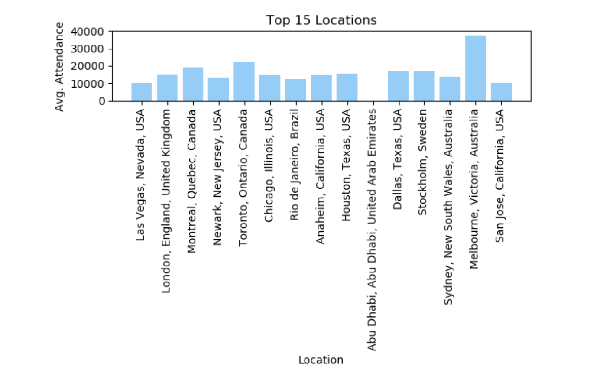

# UFC Machine Learning Model 

Core Responsibilities; Project Manager, choosing a feature to add to the model 

Tools Used; Python (Pandas, Matplotlib, Scikit-learn), Jupyter Notebook

## Overview
Used UFC data pulled through Kaggle to create a machine learning model which would predict UFC fights.

** An important aspect was choosing multiple features to include, in order for our model to be the most successful it could ** 

## Data Cleaning Process 
Data cleaning was a very essential part, as two data sets were being combined, and there were important decisions made to figure out which aspects were needed from each  

* The process started with reading in both csv datasets, with Pandas - one of them being a ‘history’ file, and the other a ‘current’ file;
* Then, for both csv’s, the dates were converted from their original date format to datetime format, by assigning the date column to a variable, also using Pandas;
* Then dates were only choosen from the ‘current’ file if they were after August 6th 2019, since all dates before then already existed in the ‘history’ file - this was done in order to not have any duplicates in the data;
* Columns were then chosen to keep in the dataframe by finding which columns were common in both files;
* The data that contained draws, women’s weight divisions, and catch weight divisions were all dropped, in order to have a more accurate model; 
    * catch weight division is when two fighters agree upon an arbitrary weight, outside the standard weight classes - this data was believed to not be very useful for the model  
* Finally, using the new filtered dates, now in datetime format, and the common columns chosen, the new, complete data frame was created

## My Chosen Feature
The feature I chose to add to the model was tracking attendance levels of each event - this came from the thought of whether a more full or more empty arena has a greater effect on the fights, this was further used to test the accuracy of our model.

## Background
In UFC, an event is where multiple fights occur, on the same date, in one arena. Since the data showed multiple fights on the same date, I knew I needed to solely search for the attendance of each date, not for each individual fight, since I only needed the attendance of that event as a whole.

Thankfully, UFC’s website keeps track of the attendance counts of each event date, from here I manually entered in over 400 attendance counts, by date, into Excel.
I then saved that data as a csv and used it to add to our model, and create this chart you can see below which shows the average attendance levels for the top 15 most frequent locations. There were some dates where the attendance was not recorded, or there were multiple events held on the same date - I dropped both of these types in order to have a more accurate dataset for the model.

